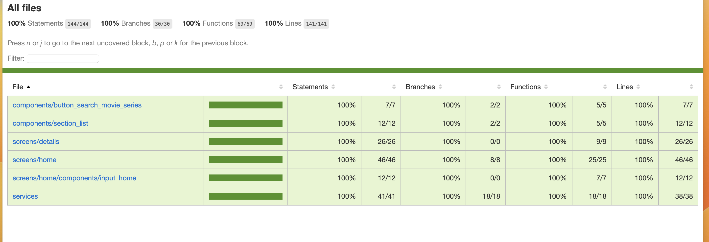

# Filmes e Series
Com este aplicativo a pessoa pode consultar filmes e series, na tela inicial possui uma lista fornecida aleatoriamente, porém é possível pesquisar por qualquer um que deseja</br>
Na tela de detalhes consegue visualizar a quantidade de likes,overview e titulo
API  usado foi essa [ The Movies DB]{(https://developer.themoviedb.org/reference/intro/getting-started)



## Feature
- Trabalhei com testes para reforçar uma deficiência minha, precisei usar [msw](https://mswjs.io/docs/) para mocar minhas requisições e [render hooks](https://react-hooks-testing-library.com/reference/api) para lidar com meus hooks customizados
- Usei bastante hooks customizados, pois arquitetura foi MVVM, então havia camadas de useViewModel e para requisições camadas de useClient
- Abaixo um boilerplate como usar MSW
- Para configuração abaixo funcionar precisei fazer umas alterações na configuração do packjson 
- No packjson declarei em setupFilesAfterEnv o arquivo correspondente a nossa configuração
- SetupFilesAfterEnv ele roda sempre antes de subir nossas env para teste
- Usei o react query para as camadas serviços, uma pequena dificuldade pode consultar por [aqui](//https://tanstack.com/query/v4/docs/react/guides/testing)
- Detalhei eu não usei nock como esta no exemplo da documentação

```typescript

// crio minha camada de handlers
// não preciso passar as query parametros nas url, pois e considerado redundante

// arquivo handlers
import { mockMovies, mockSeries } from '@/mock/mock_data'
import { Contants } from '@/utils/contants'
import { rest } from 'msw'

export const handlers = [
  rest.get(
    `${Contants.baseURLApi}/discover/movie`,
    (_, resp, ctx) => {
      return resp(ctx.status(200), ctx.json(mockMovies))
    }
  ),

  //os parâmetros opcionais, ou seja, query paramets podem ser acessados por req.url.searchParams se desejar
  //para nós o importante que retorne o mock desse json, não estamos preocupados qual a pagina, se está ordenado ou não, filtrado e por aí vai
  rest.get(`${Contants.baseURLApi}/discover/tv`, (_, resp, ctx) => {
    return resp(ctx.status(200), ctx.json(mockSeries))
  }),

  rest.get(`${Contants.baseURLApi}/discover/tv`, (_, resp, ctx) => {
    return resp(ctx.status(200), ctx.json(mockSeries))
  }),

  rest.get(`${Contants.baseURLApi}/search/movie`, (_, resp, ctx) => {
    return resp(ctx.status(200), ctx.json(mockMovies))
  }),

  rest.get(`${Contants.baseURLApi}/search/tv`, (_, resp, ctx) => {
    return resp(ctx.status(200), ctx.json(mockSeries))
  }),
]

// faço o setup

//arquivo server 
import { setupServer } from 'msw/node'
import {handlers} from '@/test/server/handlers'
 


 export const server = setupServer(...handlers)


//faço o listener para meus setup
import { server } from './server/server'

 
beforeAll(() => server.listen())

afterEach(() => server.resetHandlers())

afterAll(() => server.close())


// packjson
 "jest": {
    "preset": "react-native",
    "collectCoverage": true,
    "testEnvironment": "node",
    "setupFiles": [
      "./jestSetupFile.js"
    ],
    "globals": {
      "ts-jest": {
        "isolatedModules": false
      }
    },
    "collectCoverageFrom": [
      "./src/screens/**",
      "./src/components/**",
      "./src/services/**"
    ],
    "moduleDirectories": [
      "node_modules"
    ],
    "modulePathIgnorePatterns": [
      "mocks"
    ],
    "transformIgnorePatterns": [
      "node_modules/(?!(@react-native|react-native|react-native-vector-icons)/)"
    ],
    "coverageReporters": [
      "html"
    ],
    "setupFilesAfterEnv": [
      "@testing-library/jest-native/extend-expect",
      "./src/test/setup-env.js"
    ],
    "moduleFileExtensions": [
      "ts",
      "tsx",
      "js",
      "jsx",
      "json",
      "node"
    ]
  }


// após mocados implemente  sua requisição normalmente, retorno será o declarado no handles


// usando

// no arquivo de services


 it('should perfom request on the correct url if the current page is less or equal than 5', async () => {
    const { result, waitFor } = renderHook(() => useMoviesClient(), {
      wrapper,
    })

    await waitFor(() => {
      result.current.isSuccessMovies
    })

    act(() => {
      result.current.currentPageMovies.current = 3
      result.current.fetchPageMovies(mockMovies)
    })

    expect(result.current.fetchPageMovies(mockMovies)).toEqual(
      `/discover/movie?include_adult=false&include_null_first_air_dates=false&language=pt-BR&page=${result.current.currentPageMovies.current}&sort_by=popularity.desc`
    )
  })

  // eu sei que o retorno de fetchPageMovies será mockMovies, porque está declarado no arquivo de handlers
  // quando faço meu fetch ocorre internamente um mock pelo  MSW
  it('should return old object if current  page is greater than 5', async () => {
    const { result, waitFor } = renderHook(() => useMoviesClient(), {
      wrapper,
    })

    await waitFor(() => {
      result.current.isSuccessMovies
    })

    act(() => {
      result.current.currentPageMovies.current = 11
      result.current.fetchPageMovies(mockMovies)
    })

    expect(result.current.fetchPageMovies(mockMovies)).toEqual(
      mockMovies
    )
  })


```

##
- Para gerar o cover de nossos testes usei html, então precisei declarar na configuração do jest dentro de coverageReporters
- Também precisei declarar em collectCoverasgeFrom os arquivos que desejo que gere o cover, os testes   front end, deveria cobrir inteiração do usuário, não métodos de implementação, então o cover será apenas  de screens, componentes, services
- A camada View Model e apenas uma layer que trabalha entre a view e a model, ela pode futuramente houver várias mudanças sem impactar a view em si, então não me preocupei com o cover neste caso
- Se discorda da minha visão não e um problema, mas leia antes este [artigo](https://kentcdodds.com/blog/testing-implementation-details)
- E possível na configuração do jest pedir para ignorar certos paternes eu coloquei o mocks, que são arquivos que vou usar  para simular retorno da API


 ``` json
{
"jest": {
    "preset": "react-native",
    "collectCoverage": true,
    "testEnvironment": "node",
    "setupFiles": [
      "./jestSetupFile.js"
    ],
    "globals": {
      "ts-jest": {
        "isolatedModules": false
      }
    },
    "collectCoverageFrom": [
      "./src/screens/**",
      "./src/components/**",
      "./src/services/**"
    ],
    "moduleDirectories": [
      "node_modules"
    ],
    "modulePathIgnorePatterns": [
      "mocks"
    ],
    "transformIgnorePatterns": [
      "node_modules/(?!(@react-native|react-native|react-native-vector-icons)/)"
    ],
    "coverageReporters": [
      "html"
    ],
    "setupFilesAfterEnv": [
      "@testing-library/jest-native/extend-expect",
      "./src/test/setup-env.js"
    ],
    "moduleFileExtensions": [
      "ts",
      "tsx",
      "js",
      "jsx",
      "json",
      "node"
    ]
  }
}
```

## 
- Para criar listas infitas usando react query com react native é muito simples abaixo uma lógica que implementei e diminui muito o bolerplate
- Repara que para paginar usei o useRef e não useState , e o hasNext do react query esta na própria implementação da service , isso ajuda muito na desempenho


```typescript
// na camada service crio uma logica pra saber a pagina atual e fazer mais requisição

import { MoviesModel } from '@/models/movies_model'
import api from '@/services/api'
import { Contants } from '@/utils/contants'
import {
  InfiniteData,
  InfiniteQueryObserverResult,
  useInfiniteQuery,
} from '@tanstack/react-query'
import { MutableRefObject, useRef, useState } from 'react'

export interface IUseMoviesClient {
  dataMovies: InfiniteData<MoviesModel>
  isFetchingMovies: boolean
  handleMoreDataMovies: () => void
  isSuccessMovies: boolean
  currentPageMovies: MutableRefObject<number>
  fetchPageMovies: (discover: MoviesModel) => void
  fetchMovies: (currentPage: number) => Promise<MoviesModel>
}

export async function fetchMovies(currentPage: number) {
  const response = await api.get(
    `/discover/movie?include_adult=false&include_null_first_air_dates=false&language=pt-BR&page=${currentPage}&sort_by=popularity.desc`
  )
  return response.data as MoviesModel
}

export default function useMoviesClient(): IUseMoviesClient {
  let currentPageMovies = useRef(1)

  function fetchPageMovies(discover: MoviesModel) {
    if (currentPageMovies.current <= 5) {
      return `/discover/movie?include_adult=false&include_null_first_air_dates=false&language=pt-BR&page=${currentPageMovies.current}&sort_by=popularity.desc`
    }

    return discover
  }

  const {
    data: dataMovies = {} as InfiniteData<MoviesModel>,
    hasNextPage = true,
    isFetching: isFetchingMovies,
    isSuccess: isSuccessMovies,
    fetchNextPage: fetchPagesMovies,
  } = useInfiniteQuery(
    [Contants.keyReactQuerySerie],
    () => fetchMovies(currentPageMovies.current),
    {
      getNextPageParam: fetchPageMovies,
    }
  )

  function handleMoreDataMovies() {
    if (hasNextPage && currentPageMovies.current <= 5) {
      currentPageMovies.current += 1
      fetchPagesMovies()
    }
  }

  return {
    isFetchingMovies,
    dataMovies,
    handleMoreDataMovies,
    isSuccessMovies,
    fetchPageMovies,
    currentPageMovies,
    fetchMovies,
  }
}


//a camada view model, foi apenas uma layer de abstração, poderia colocar direto na view, mas não é aconselhável usando MVVM

//no arquivo useHomeViewModel
export default function useHomeViewModel(): IHomeViewModel {

 const {
    isFetchingSeries,
    dataSeries,
    handleMoreDataSeries,
    isSucessSeries,
  } = useSeriesClient()


  return {
    isFetchingSeries,
    dataSeries,
    handleMoreDataSeries,
    isSucessSeries
  }

}

// na view e bem simples
   <SectionList
       isSuccess={isSucessSeries}
       testID={Contants.testIdSectionListSeriesMovies}
       titleSection='Series'
       renderDetails={({ item }) => (
            <RenderItemSeries
                    item={item}
                    handleNavigationSeries={handleNavigationSeries}
                  />
              )}
        data={dataSeries.pages
                  ?.map((page) => page.results)
                  .flat()}
        onEndReached={handleMoreDataSeries}
        ListFooterComponent={
                  <FooterComponent showComponent={isFetchingMovies} />
                }
    />


```

##

- Eu estou usando a FlahsList do react native, um pacote que otimiza a flatlist, para testar ela precisamos mocar o layout
- Os itens são renderizados de forma lazy é assim o teste pode falhar, [consulte aqui para mais detalhes](https://shopify.github.io/flash-list/docs/testing)
- Abaixo tem dois exemplos com uso do fireEvent um e para simular o layout  é o outro o evento onContentSizeChange
- onContentSizeChange e um evento que uso para deixar o campo do input de forma dinâmica, gerando assim uma sensação melhor para usurário

``` typescript
describe('SectionList', () => {
 const renderDetails = ({ item }: { item: SeriesResults }) => {
    return <Text>{item.name}</Text>
  }

  const mockEvent = {
    nativeEvent: {
      layout: {
        width: 1000,
        height: 350,
      },
    },


   it('SectionList should render items with data', () => {
    const { getByText, getByTestId } = render(
      <SectionList
        isSuccess={true}
        data={mockSeries.results}
        titleSection={''}
        renderDetails={renderDetails}
      />
    )
    const element = getByTestId(Contants.testIdSeriesMoviesItem)
    fireEvent(element, 'layout', mockEvent)
    expect(getByText('Voltes')).toBeTruthy()
    expect(getByText('Voltes V')).toBeTruthy()
  })

}


// outro exemplo de uso do fireEvent
// repara que o tamanho sera 57, porque para jest saber o tamanho do contentSize precisei mocar e coloquei 50

  const mockHandleHeightInput = jest.fn()

    const mockEventContentSize = {
    nativeEvent: { contentSize: { height: 50 } },
  }

  it('should set the height of the input field correctly', () => {
    const { getByRole } = render(
      <InputHome
        height={20}
        onContentSizeChange={(e) =>
          mockHandleHeightInput(e.nativeEvent.contentSize.height + 7)
        }
      />
    )
    const element = getByRole('search')
    fireEvent(element, 'onContentSizeChange', mockEventContentSize)
    expect(mockHandleHeightInput).toBeCalledWith(57)
  })


```

### 

- Dicas simples que salva muito, para quebrar linhas em texto podemos usar numberOfLines={1}
- Se preciso que um texto tenha 3 linhas e só colocar numberOfLines={3} e quando não houver mais espaço ficara 3 dots
- Para realizar o input de forma dinâmica todo o estilo fica na view, o input fica apenas o estilo de texto e altura
- Padding, altura dinâmica fica tudo na view


```typescript

// view de input dinamico

export default function InputHome({
  height,
  ...rest
}: IInputHomeProops) {
  const { color } = useTheme()
  return (
    <Styles.viewInput>
      <Styles.viewOffsetHeight
        testID={Contants.testIdWrapperInputWithIcon}
        height={height}>
        <Styles.prefix
          testID={Contants.testIdIconInputHome}
          height={height}>
          <Evillcons
            name='search'
            size={23}
            color={color.grayLight}
          />
        </Styles.prefix>
        <Styles.input
          height={height}
          {...rest}
          multiline
          returnKeyType='search'
          accessibilityRole='search'
          placeholderTextColor={color.grayLight}
        />
      </Styles.viewOffsetHeight>
    </Styles.viewInput>
  )
}


//estilo 
export const viewOffsetHeight = styled.View<IVieOffeset>`
  height: ${({ height }) => height}px;
  position: relative;
  padding: 20px 0px;
  justify-content: center;
  padding-left: 55px;
  padding-right: 10px;
  border-width: 1px;
  border-color: ${({ theme }) => theme.color.grayLight};
  border-radius: 20px;
`

export const input = styled.TextInput<IVieOffeset>`
  font-family: ${({ theme }) => theme.fonts.light};
  font-size: 17px;
  line-height: 21px;
  color: ${({ theme }) => theme.color.grayLight};
`


```


  

 
